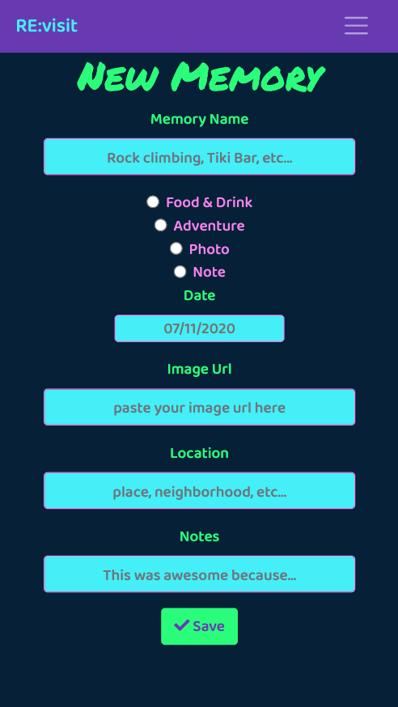

# NSS Frontend Capstone: "RE:visit"

### Requirements:

- [x] React - *Creation and Routing*
- [x] Firebase - *Authentication, Database, and Hosting*
- [x] Github - *Version Control and Project Planning*
- [x] Display comprehension and mastery of technologies from the first 6 months of frontend developer bootcamp

### Technologies Used:
> - [HTML5](https://developer.mozilla.org/en-US/docs/Web/HTML)
> - [CSS](https://developer.mozilla.org/en-US/docs/Glossary/CSS), [Sass](https://sass-lang.com/)
> - [JavaScript](https://developer.mozilla.org/en-US/docs/Glossary/JavaScript), [JSX]()
> - [Bootstrap](https://getbootstrap.com/), [Reactstrap](https://reactstrap.github.io/)
> - [Moment.js](https://momentjs.com/)
> - [React Datepicker](https://github.com/Hacker0x01/react-datepicker)
> - [React Confirm Alert](https://github.com/GA-MO/react-confirm-alert)

### Description:
##### "Your Travel Scrapbook"
> Users access their account with Google authenticated login. 

> Create Trips with user-customized names and dates, and then add Memories, like a scrapbook.  Memories can be Adventures, Food & Drink, Photos, or Notes.
 
> Users can edit or delete their Trips and Memories.

#### Landing Page for Unauthenticated Users

#### Dashboard for Authenticated Users (navigation open)

#### Single Trip (with associated Memories)

#### Single Memory details

#### Adding a new Trip

#### Adding a new Memory

#### Delete confirmation

### Instructions to Run:
[Click here to view the deployed web app](https://re-visit-app.web.app/)

Or, Run Locally:
1. If you do not have npm http-server installed, follow instuctions [here](https://www.npmjs.com/package/http-server) to install on your device
1. Use GitHub's [Cloning Feature](https://help.github.com/en/github/creating-cloning-and-archiving-repositories/cloning-a-repository) to download a local copy of the files for this project
1. In your command line interface, change directory into the folder that contains your copied files
1. Enter command: `npm install` and wait for completion
1. Enter command: `npm start`
1. The project will automatically render in your browser at url: `http://localhost:8080`

### Specs:
Instructor: [Zoe Ames](https://github.com/zoeames)  
[Nashville Software School](https://github.com/nashville-software-school)   
